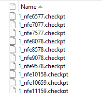

# Run Borg MOEA and Matlab Wrapper

# Introduction

Borg is a multi-objective evolutionary algorithm written in C, with wrappers available for Python, MATLAB, R, Java, and C++ to support broader accessibility and application. You can find resources for application of different wrappers [here](https://waterprogramming.wordpress.com/2025/02/04/everything-you-need-to-run-borg-moea-and-serial-python-wrapper-part-1/). In this post, the ***checkpointing*** feature is introduced for **MATLAB**. All the supporting files can be found in the GitHub repository [Matlab_Borg_Training](https://github.com/ssaiveena/Matlab_Borg_Training). 

This blog post and repository includes compiling the shared library from C code, setting up a script for running Borg through Matlab wrapper, introducing the checkpoint feature
and streamlined tools for computing performance metrics (e.g., hypervolume) using MOEAFramework. 

# Prerequisites
You will need access to Borg, request [here](https://docs.google.com/forms/d/e/1FAIpQLSfuBBDJyEVw6D8PLvwx9hmOqpmw7MCyjpeOMVbxGXzxZkG2wg/viewform).

## Matlab plugin
- [BorgMOEA](https://github.com/BorgMOEA/BorgMOEA): 
    - borg.c and borg.h
- The MATLAB plugin files are updated in the repository [Matlab_Borg_Training](https://github.com/ssaiveena/Matlab_Borg_Training) for getting runtime dynamics and checkpointing. 

This post is a consolidation and updated to latest version of previous posts
    - [Performing random seed analysis and runtime diagnostics with the serial Borg Matlab wrapper](https://waterprogramming.wordpress.com/2019/04/17/performing-random-seed-analysis-and-runtime-diagnostics-with-the-serial-borg-matlab-wrapper/)
    - [Update on setting up the Borg Matlab Wrapper on Windows and tips for its use](https://waterprogramming.wordpress.com/2018/07/19/update-on-setting-up-the-borg-matlab-wrapper-on-windows-and-tips-for-its-use/)
    - [Compiling the Borg Matlab Wrapper (OSX/Linux)](https://waterprogramming.wordpress.com/2014/02/18/compiling-the-borg-matlab-wrapper-osxlinux/)
    - [Everything You Need to Run Borg MOEA and Python Wrapper – Part 2](https://waterprogramming.wordpress.com/2025/02/19/everything-you-need-to-run-borg-moea-and-python-wrapper-part-2/)
    - [Setting Borg parameters from the Matlab wrapper](https://waterprogramming.wordpress.com/2015/03/13/setting-borg-parameters-from-the-matlab-wrapper/)
Thanks to all the authors!!

## [Matlab_Borg_Training](https://github.com/ssaiveena/Matlab_Borg_Training) repository
I created a workflow using Borg in the [Matlab_Borg_Training](https://github.com/ssaiveena/Matlab_Borg_Training) repository. It contains the updated 'borg.m' and 'nativeborg.cpp' files.
Following are the steps to set-up
####Step0: Get all the files in same folder
You will need to have the following files in the same directory:
-borg.c (from [BorgMOEA](https://github.com/BorgMOEA/BorgMOEA))
-borg.h (from [BorgMOEA](https://github.com/BorgMOEA/BorgMOEA))
-mt19937ar.c (from [BorgMOEA](https://github.com/BorgMOEA/BorgMOEA))
-mt19937ar.h (from [BorgMOEA](https://github.com/BorgMOEA/BorgMOEA))
-nativeborg.cpp (from [Matlab_Borg_Training](https://github.com/ssaiveena/Matlab_Borg_Training))
-borg.m (from [Matlab_Borg_Training](https://github.com/ssaiveena/Matlab_Borg_Training))
-DTLZ2.m (from [Matlab_Borg_Training](https://github.com/ssaiveena/Matlab_Borg_Training))

#### Step1: Edits to code borg.h
Replace lines 683-691 as follows to call the file name and directory in Matlab
```c
/**
 * Save a checkpoint file.
 */
BORG_API void BORG_Algorithm_checkpoint(BORG_Algorithm algorithm, const char *baseFilename);//edited

/**
 * Loads a checkpoint file.
 */
BORG_API void BORG_Algorithm_restore(BORG_Algorithm algorithm, const char *baseOldFilename);//edited 
```
#### Step2: Edits to code borg.c
Line 43 in borg.c, add variables for checkpoint file names
```c
char* newCheckptFilename = NULL;
char* oldCheckptFilename = NULL;
```
edit function Borg_Algorithm_checkpoint as follow; the remaning lines in the function are the same
```c
void BORG_Algorithm_checkpoint(BORG_Algorithm algorithm, const char *baseFilename) {
	int i;
	int j;
	
	///append number of function evaluations to baseline checkpoint filename
	char currentCheckptFilename[50];
	sprintf(currentCheckptFilename, "%s_nfe%d.checkpt", baseFilename, algorithm->numberOfEvaluations);
	FILE *file = fopen(currentCheckptFilename, "w");

	BORG_Validate_pointer(algorithm);
	BORG_Validate_file(file);
```
edit function Borg_Algorithm_restore as follows; the remaning lines in the function are the same
```c
void BORG_Algorithm_restore(BORG_Algorithm algorithm, const char *baseOldFilename) {
	int i;
	int j;
	int readInt;
	double readDouble;
	int populationSize;
	int populationCapacity;
	int archiveSize;
	BORG_Entry entry;

    char oldCheckptFilename[50];
	sprintf(oldCheckptFilename, "%s", baseOldFilename);
	///get old checkpt filename to restore from input 
    FILE *file = fopen(oldCheckptFilename, "r");
	printf("%s\n", file);

	BORG_Validate_pointer(algorithm);
	BORG_Validate_file(file);
```

#### Step3: check compiler in Matlab 
At Matlab command line run:
```matlab
mex -setup
```
#### Step4: Compile Borg in Matlab

##### On Windows
The Borg MOEA plugin for Matlab will use the `mex` compiler to produce a "mex file". 
```matlab
mex nativeborg.cpp borg.c mt19937ar.c
```
The file nativeborg.mexw64 should be created (the extension should vary according to your system). Once you do that you are done, and you are ready to run the test problem.

##### On Linux
```bash
gcc -c borg.c
gcc -c mt19937ar.c
gcc -shared -o libborg.so borg.o mt19937ar.o
```
The file libborg.so is the shared library that is created and make sure to have this file in the same directory.
Next step is to use the mex compiler.
```matlab
mex nativeborg.cpp libborg.so
```
Refer to this [post](https://waterprogramming.wordpress.com/2014/02/18/compiling-the-borg-matlab-wrapper-osxlinux/) for any troubleshooting. 

### Introducing the checkpoint and restore runs feature
Checkpointing feature for Matlab is introduced in this blog post. Refer to this [blog post](https://waterprogramming.wordpress.com/2022/04/13/checkpointing-and-restoring-runs-with-the-borg-moea/) to learn about checkpointing.

#### Summary of revised `borg.m` and `nativeborg.cpp`
- Introduce variables as newCond, newCheckptFilename, oldCond, oldCheckptFilename 
- Update the line calling nativeborg
- Automatically converts paths to bytes before passing them into C-Borg.
- Add lines to create checkpoint feature
- Add lines to restore runs using the existing checkpoint files

### Matlab script for running Borg to the defined problem (DTLZ2 in this case) with saving checkpoint files
Before running the following script, create folders Checkpoint, Objectives and Runtime to save checkpoint files, objective and runtime files respectively.
```matlab
%Use the evaluation function DTLZ2.m in the folder
for i = [1:3] %i is to run across multiple seeds
    [vars, objs, runtime] = borg(11,2,0, @DTLZ2, 30000,[0.01, 0.01], zeros(1,11),ones(1,11),  {'frequency',500, 'seed', i},1,1,sprintf('Checkpoint/%d', i));
    %borg(nvars, nobjs, nconstrs, objectiveFcn, NFE, epsilons, lowerBounds, upperBounds, parameters,transposed, newCond, newCheckptFilename)
    objFile = sprintf('Objectives/DTLZ2_3_S%i.obj',i);
    dlmwrite(objFile, objs, 'Delimiter', ' ');
end
```
The above example shows setting up the checkpoint output. Define newCond = 1 (this could be any value other than 0) and add the `newCheckpointFilename` argument as the folder to save checkpoint files. This will instruct Borg to output `.checkpt` files at the same frequency as the runtime files.The checkpoint files generated will look as follows in the Checkpoint folder.


### Restoring Borg runs in Matlab
As we save the checkpoint files, you can restore your optimization by providing any existing `.checkpt` file to the `oldCheckptFilename` argument. This is a convenient feature to prevent unexpected program shutdowns, runtime constraints, or to simply reuse previous search results. An example run for one seed is as follows. Be cautious of the checkpoint file name as they may be different for different seeds. If you give a wrong checkpoint file name, Matlab crashes. 
```matlab
%Use the evaluation function DTLZ2.m in the folder
i=1%applying for one seed
[vars, objs, runtime] = borg(11,2,0, @DTLZ2, 30000,[0.01, 0.01], zeros(1,11),ones(1,11),  {'frequency',500, 'seed', i},1,1,'NewCheckpoint/1',1,'Checkpoint/1_nfe6575.checkpt');
%borg(nvars, nobjs, nconstrs, objectiveFcn, NFE, epsilons, lowerBounds, upperBounds, parameters,transposed, newCond, newCheckptFilename, oldCond, oldCheckptFilename)
objFile = sprintf('Objectives/DTLZ2_3_S%i.obj',i);
dlmwrite(objFile, objs, 'Delimiter', ' ');
```
The above example shows setting up the checkpoint output and restoring rusn using the existing checkpoint files. Define oldCond = 1 (this could be any value other than 0) and add the `oldCheckpointFilename` argument as the folder to restore runs. Defining `newCheckptFilename` will instruct Borg to output `.checkpt` files at the same frequency as the runtime file from the restored runs. In this case, checkpoint files are saved in the `NewCheckpoint` folder (make sure to create the folder before running the above script) for the runs restored from NFE of 6575. The `NewCheckpoint` folder has runs from nfe 6577 as in teh figure below



### Some troubleshooting 
I faced mutliple crashes during this process; the matlab closed without showing an error. In that case, the problem is generally in the nativeborg.cpp file; where variables are not defined as desired. Use the following command to print the variables and check if evaluated correctly. 
```c++
mexPrintf("New Checkpoint Filename: %s\n", newCheckptFilename);
```

### Streamlined tools for computing performance metrics (e.g., hypervolume) using MOEAFramework
Once we complete the search, we want to diagnose the performance, often by conducting a random seed diagnosis. After running Borg with different seeds using the scripts above, we will use MOEAFramework to analyze the runtime files. MOEAFramework is programmed in Java, and we will only use its command-line features. For a full description, please see [here](https://moeaframework.org/).

Refer to this [blog post](https://waterprogramming.wordpress.com/2025/03/18/introducing-moeaframework-v5-0/) for generating runtime files using the new version

Refer to this [blog post](https://waterprogramming.wordpress.com/2019/04/17/performing-random-seed-analysis-and-runtime-diagnostics-with-the-serial-borg-matlab-wrapper/) for older version of MOEA framework