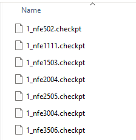

# Run Borg MOEA and Matlab Wrapper

# Introduction

Borg is a multi-objective evolutionary algorithm written in C, with wrappers available for Python, MATLAB, R, Java, and C++ to support broader accessibility and application. You can find resources for application of different wrappers [here](https://waterprogramming.wordpress.com/2025/02/04/everything-you-need-to-run-borg-moea-and-serial-python-wrapper-part-1/). In this post, the ***checkpointing*** feature is introduced for **MATLAB**. All the supporting files can be found in the GitHub repository [Matlab_Borg_Training](https://github.com/ssaiveena/Matlab_Borg_Training). 

This blog post and repository include:
1. [Compiling a shared library from C code](#1-compiling-a-shared-library-from-c-code)
2. [Setting up a script for running Borg through Matlab wrapper](#2-setting-up-a-python-script-for-running-parallel-borg-through-a-python-wrapper)
3. [Introducing the checkpoint feature](#3-introducing-the-checkpoint-feature)
4. [Streamlined tools for computing performance metrics (e.g., hypervolume) using MOEAFramework](#4-streamlined-tools-for-computing-performance-metrics-eg-hypervolume-using-moeaframework)
5. [Conducting random seed diagnosis and interactive plotting using Plotly](#5-conducting-random-seed-diagnosis-and-interactive-plotting-using-plotly)

# Prerequisites
You will need access to Borg, request [here](https://docs.google.com/forms/d/e/1FAIpQLSfuBBDJyEVw6D8PLvwx9hmOqpmw7MCyjpeOMVbxGXzxZkG2wg/viewform).

## Matlab plugin
- [BorgMOEA](https://github.com/BorgMOEA/BorgMOEA): 
    - Serial - borg.c and borg.h
- The Matlab plugin files are updated in the repository for getting runtime dynamics and checkpointing. 

## [BorgTraining](https://github.com/philip928lin/BorgTraining) repository
I created a workflow using Borg in the `BorgTraining` repository. It contains the revised `borg.py` and pre-compiled `.so` files.

You will likely need to recompile the `.so` files for your machine, as I will show you below. The pre-compiled version is for the Hopper cluster at Cornell.

After clone the repo, install required package by
```
pip install -r requirements.txt
```

# 1. Compiling a shared library from C code
## Python plugin
The Python plugin enables integration of the Borg MOEA by using the shared library (e.g., `libborg.so` on Linux or `borg.dll` on Windows). We provide more details about the shared library on Linux below.

## Compiling the Shared Library
To obtain machine-specific shared libraries, we need to **compile** the C code first. We use `GNU C Compiler (gcc)` here.

So, what you need to do is to 
1. clone [BorgMOEA](https://github.com/BorgMOEA/BorgMOEA) or [MMBorgMOEA](https://github.com/MMBorgMOEA/MMBorgMOEA) or other versions to your local machine.
2. `cd` to the folder and compile the shared libraries using the commands I provide below.
3. **[Important]** Copy the compiled the shared libraries to `BorgTraining` folder. The shared libraries need to be in the same folder of other python scripts.

### Serial - borg.c and borg.h
```bash
gcc -shared -fPIC -O3 -o libborg.so borg.c mt19937ar.c -lm
```
This command compiles and links C source files into a shared library on Unix-based systems using the GCC. Here's a breakdown of the command:

1. **`gcc`**: This is the command to invoke the GCC compiler.

2. **`-shared`**: This option tells GCC to produce a shared library. Shared libraries are used for dynamic linking, which means multiple programs can share the code in the library rather than including the same code in their executable.

3. **`-fPIC`**: This stands for "Position Independent Code." It's necessary for shared libraries so that they can be loaded at any memory address without needing to be modified. This flexibility is crucial for the efficient use of memory.

4. **`-O3`**: This is one of the compiler optimization levels. `-O3` provides more aggressive optimizations than `-O2`, aiming to improve performance and speed of the compiled code. However, it might increase the compile time and the size of the generated code.

5. **`-o libborg.so`**: This specifies the output file name (`libborg.so`). The `.so` extension indicates a shared object library on Linux and other Unix-like operating systems.

6. **`borg.c mt19937ar.c`**: These are the source files to be compiled and linked into the shared library. `borg.c` might be your main library code, and `mt19937ar.c` could contain the implementation of the Mersenne Twister random number generator, as suggested by the name.

7. **`-lm`**: This tells the linker to link against the math library (`libm`). This library provides various mathematical functions standard in C, like `sin`, `cos`, and `sqrt`.

### Checkpoint version
To compile the shared libraries with the checkpoint feature, use [MMBorgMOEA - passNFE_ALH_PyCheckpoint branch](github.com/MMBorgMOEA/MMBorgMOEA/tree/passNFE_ALH_PyCheckpoint). However, before you run the above commands, do comment out lines 2842 and 2843 in `borg.c` to avoid errors when restoring a `.checkpoint` file.

```c
// BORG_Check_scan1(fscanf(file, "Next Guassian: %lg\n", &nextNextGaussian));
// BORG_Check_scan1(fscanf(file, "Have Next Guassian: %d\n", &haveNextNextGaussian));
```

# 2. Setting up a Python script for running parallel Borg through a Python wrapper
## Python wrapper - `borg.py`

We can apply Borg to our Python script through `borg.py`. The first step is to place `borg.py`, the compiled shared libraries (i.e., `libborg.so`, `libborgms.so`, and `libborgmm.so`), and your Python script in the same directory. The [BorgTraining](https://github.com/philip928lin/BorgTraining) repo already contain them,
the revised versions.

- `libborg.so` is the default for serial Borg.
- `libborgmm.so` is the default for master-slave and multi-master. 
- `libborgms.so` is used for master-slave if `libborgmm.so` is not found. 

`borg.py` contains predefined classes to access features offered by the shared libraries. However, it is not comprehensive. Not all features in the shared libraries have been wrapped into `borg.py`. Users may consult the original C code to see what additional features and settings are available. Below, I am going to document examples using my revised `borg.py`, for both `libborg.so` (serial) and `libborgmm.so` (master-slave and multi-master).

### Summary of revised `borg.py`
- Added a `seed` argument to set up the random seed.
- Corrected the serial runtime output (`runtimeformat='borg'`) format to fit the MOEAFramework.
- Automatically converts paths to bytes before passing them into C-Borg.
- Integrated the checkpoint feature.

## Example of serial Borg with `borg.py` on Hopper cluster 
### Step 1: Python script for running Borg with your defined problem
```python
import os
import sys
import numpy as np
from pathnavigator import PathNavigator

##### Set for parallel borg
from borg import *

root_dir = os.path.expanduser("~/Github/BorgTraining")
pn = PathNavigator(root_dir)
pn.chdir()


##### Load sys args ####################################################################
# job ID
job_id = "00000"
if len(sys.argv) > 1:
    job_id = sys.argv[1]  # Capture the  from the command line

# Random seed for Borg
borg_seed = None
if len(sys.argv) > 2 and sys.argv[2] != "None":
    borg_seed = int(sys.argv[2])  # Capture the seed from the command line

##### Define the evaluation function for Borg ##########################################
nvars = 8
nobjs = 3
def DTLZ2(*vars):
    g = 0
    k = nvars - nobjs + 1
    for i in range(nvars-k, nvars):
        g = g + (vars[i] - 0.5)**2
 
    objs = [1.0 + g]*nobjs
 
    for i in range(nobjs):
        for j in range(nobjs-i-1):
            objs[i] = objs[i] * np.cos(0.5 * np.pi * vars[j])
        if i != 0:
            objs[i] = objs[i] * np.sin(0.5 * np.pi * vars[nobjs-i-1])
 
    return objs,


##### Borg settings ####################################################################
nconstrs = 0
nfe = 500
runtime_freq = 50

borg_settings = {
    "numberOfVariables": nvars,
    "numberOfObjectives": nobjs,
    "numberOfConstraints": nconstrs,
    "function": DTLZ2,
    "epsilons": [0.01] * nobjs,
    "bounds": [[0, 1]] * nvars,
    "directions": None,  # default is to minimize all objectives. keep this unchanged.
    "seed": borg_seed
}
borg = Borg(**borg_settings)

##### Serial borg - solve ##############################################################
pn.mkdir("outputs")
pn.outputs.mkdir("checkpoints")

# Runtime
runtime_filename = pn.outputs.get() / f"serial_{job_id}_nfe{nfe}_seed{borg_seed}.runtime"

# Checkpoint
newCheckpointFileBase_filename = pn.outputs.checkpoints.get() / f"serial_{job_id}_nfe{nfe}_seed{borg_seed}"
oldCheckpointFile_filename = pn.outputs.checkpoints.get() / f"serial_xxx.checkpoints"

solve_settings = {
    "maxEvaluations": nfe,
    "frequency": 50,
    "runtimefile": str(runtime_filename),
    "runtimeformat": 'borg',
    "newCheckpointFileBase": newCheckpointFileBase_filename,
    #"oldCheckpointFile": oldCheckpointFile_filename
}

result = borg.solve(settings=solve_settings)


##### Save results #####################################################################
#result.display()
if result is not None:
    # The result will only be returned from one node
    with open(pn.outputs.get() / f"serial_{job_id}_nfe{nfe}_seed{borg_seed}.csv", "w") as file:
        # You may add header here
        file.write(",".join(
            [f"var{i+1}" for i in range(nvars)]
            + [f"obj{i+1}" for i in range(nobjs)]
            + [f"constr{i+1}" for i in range(nconstrs)]
            ) + "\n")
        result.display(out=file, separator=",")

    # Write the dictionary to a file in a readable format
    with open(pn.outputs.get() / f"serial_{job_id}_nfe{nfe}_seed{borg_seed}.info", 'w') as file:
        file.write("\nBorg settings\n")
        file.write("=================\n")
        for key, value in borg_settings.items():
            file.write(f"{key}: {value}\n")
        file.write("\nBorg solve settings\n")
        file.write("=================\n")
        for key, value in solve_settings.items():
            file.write(f"{key}: {value}\n")
```
### Step 2: Prepare bash script for SLUM job submission
The example below will submit jobs sequentially for 10 random seeds. 
```bash
#!/bin/bash
#SBATCH --job-name=DTLZ2        # Job name
#SBATCH --output=./logs/%j.out  # Standard output log file with job ID
#SBATCH --error=./logs/%j.err   # Standard error log file with job ID
#SBATCH --nodes=1                          # Number of nodes to use
#SBATCH --ntasks-per-node=1               # Number of tasks (processes) per node
#SBATCH --exclusive                        # Use the node exclusively for this job
#SBATCH --mail-type=END                    # Send email at job end
#SBATCH --mail-user=xxx@cornell.edu     # Email for notifications

# Remember to create ./logs/ first!

# Load Python module
module load python/3.11.5

# Activate Python virtual environment
source ~/VEnvs/drb/bin/activate

# Function to submit the job
submit_job() {
    local seed=$1
    # Print start message and the number of nodes and tasks per node
    datetime=$(date '+%Y-%m-%d %H:%M:%S')
    n_processors=$(($SLURM_NNODES * $SLURM_NTASKS_PER_NODE))

    echo "[JobID $SLURM_JOB_ID] Running dps_borg simulation with seed $seed ..."
    echo "Number of nodes: $SLURM_NNODES"
    echo "Tasks per node: $SLURM_NTASKS_PER_NODE"
    echo "Total number of processors: $n_processors"
    echo "Datetime: $datetime"

    # Run the script with MPI and time the execution
    time python serial_DTLZ2_example.py $SLURM_JOB_ID $seed

    # Ensure the job finishes before proceeding to the next
    #wait
}


# Loop to submit jobs with different seeds
for seed in {1..10}; do 
    submit_job $seed
done
```
### Step 3: Look into `borg.py` and `C-Borg` code (optional)
Again, I found the current `borg.py` and `C-Borg` is not perfect. A careful inspection 
to the code is necessary for debugging or access for more advanced setting to the borg 
algorithm!


## Example of master-slave and multi-master Borg with `borg.py` on Hopper cluster 

### Step 1: Python script for running Borg with your defined problem
```python
import os
import sys
import numpy as np
from pathnavigator import PathNavigator
# pathnavigator is a Python package I developed. See github.com/philip928lin/PathNavigator

##### Set for parallel borg
from borg import *
Configuration.startMPI()

root_dir = os.path.expanduser("~/Github/BorgTraining")
pn = PathNavigator(root_dir)
pn.chdir()

##### Load sys args ####################################################################
# job ID
job_id = "00000" # Default value
if len(sys.argv) > 1:
    job_id = sys.argv[1]  # Capture the job id from the command line

# Random seed for Borg
borg_seed = None # Default value
if len(sys.argv) > 2 and sys.argv[2] != "None":
    borg_seed = int(sys.argv[2])  # Capture the seed from the command line

##### Define the evaluation function for Borg ##########################################
nvars = 8
nobjs = 3
def DTLZ2(*vars):
    g = 0
    k = nvars - nobjs + 1
    for i in range(nvars-k, nvars):
        g = g + (vars[i] - 0.5)**2
 
    objs = [1.0 + g]*nobjs
 
    for i in range(nobjs):
        for j in range(nobjs-i-1):
            objs[i] = objs[i] * np.cos(0.5 * np.pi * vars[j])
        if i != 0:
            objs[i] = objs[i] * np.sin(0.5 * np.pi * vars[nobjs-i-1])
 
    return objs,

##### Borg settings ####################################################################
nconstrs = 0
nfe = 10_000 # Number of function evaluation 
runtime_freq = 250 # output frequency
islands = 1 # 1 = MW, >1 = MM
# Note the total NFE is islands * nfe

borg_settings = {
    "numberOfVariables": nvars,
    "numberOfObjectives": nobjs,
    "numberOfConstraints": nconstrs,
    "function": DTLZ2,
    "epsilons": [0.01] * nobjs,
    "bounds": [[0, 1]] * nvars,
    "directions": None,  # default is to minimize all objectives. keep this unchanged.
    "seed": borg_seed
}
borg = Borg(**borg_settings)

##### Parallel borg - solvempi #########################################################
# Make output and checkpoints directories
pn.mkdir("outputs") 
pn.outputs.mkdir("checkpoints")

# Runtime
if islands == 1: # Master slave version
    runtime_filename = pn.outputs.get() / f"parallel_{job_id}_nfe{nfe}_seed{borg_seed}.runtime"
else:
    # For MMBorg, the filename should include one %d which gets replaced by the island index
    runtime_filename = pn.outputs.get() / f"parallel_{job_id}_nfe{nfe}_seed{borg_seed}_%d.runtime"
    
# Checkpoint
newCheckpointFileBase_filename = pn.outputs.checkpoints.get() / f"parallel_{job_id}_nfe{nfe}_seed{borg_seed}"

# Load previous checkpoint (the file must already exist)
oldCheckpointFile_filename = pn.outputs.checkpoints.get() / "parallel_108649_nfe300_seed1_nfe100.checkpoint"

# Evaluation
evaluationFile_filename = pn.outputs.get() / f"{job_id}_nfe{nfe}_seed{borg_seed}.eval"

solvempi_settings = {
    "islands": islands,
    "maxTime": None,
    "maxEvaluations": nfe,  # Total NFE is islands * maxEvaluations if island > 1
    "initialization": None,
    "runtime": runtime_filename,
    "allEvaluations": None,
    "frequency": runtime_freq,
    "newCheckpointFileBase": newCheckpointFileBase_filename, # Output checkpoint
    #"oldCheckpointFile": oldCheckpointFile_filename, # Load checkpoint if uncommented
    #"evaluationFile": evaluationFile_filename
}

result = borg.solveMPI(**solvempi_settings)

##### Save results #####################################################################
if result is not None:
    # The result will only be returned from one node
    with open(pn.outputs.get() / f"{job_id}_nfe{nfe}_seed{borg_seed}.csv", "w") as file:
        # You may add header here
        file.write(",".join(
            [f"var{i+1}" for i in range(nvars)]
            + [f"obj{i+1}" for i in range(nobjs)]
            + [f"constr{i+1}" for i in range(nconstrs)]
            ) + "\n")
        result.display(out=file, separator=",")

    # Write the dictionary to a file in a readable format
    with open(pn.outputs.get() / f"{job_id}_nfe{nfe}_seed{borg_seed}.info", 'w') as file:
        file.write("\nBorg settings\n")
        file.write("=================\n")
        for key, value in borg_settings.items():
            file.write(f"{key}: {value}\n")
        file.write("\nBorg solveMPI settings\n")
        file.write("=================\n")
        for key, value in solvempi_settings.items():
            file.write(f"{key}: {value}\n")

    if islands == 1:
        print(f"Master: Completed dps_borg_{job_id}_nfe{nfe}_seed{borg_seed}.csv")
    elif islands > 1:
        print(f"Multi-master controller: Completed dps_borg_{job_id}_nfe{nfe}_seed{borg_seed}.csv")

##### End MPI #########################################################################
Configuration.stopMPI()
```

### Step 2: Prepare bash script for SLUM job submission
The example below will submit jobs squencially for 10 random seeds. 
```bash
#!/bin/bash
#SBATCH --job-name=DTLZ2        # Job name
#SBATCH --output=./logs/%j.out  # Standard output log file with job ID
#SBATCH --error=./logs/%j.err   # Standard error log file with job ID
#SBATCH --nodes=3                          # Number of nodes to use
#SBATCH --ntasks-per-node=40               # Number of tasks (processes) per node
#SBATCH --exclusive                        # Use the node exclusively for this job
#SBATCH --mail-type=END                    # Send email at job end
#SBATCH --mail-user=xxx@cornell.edu     # Email for notifications

# Remember to create ./logs/ first!

# Load Python module
module load python/3.11.5

# Activate Python virtual environment (env in this case)
source ~/VEnvs/env/bin/activate

# Function to submit the job
submit_job() {
    local seed=$1
    # Print start message and the number of nodes and tasks per node
    datetime=$(date '+%Y-%m-%d %H:%M:%S')
    n_processors=$(($SLURM_NNODES * $SLURM_NTASKS_PER_NODE))

    echo "[JobID $SLURM_JOB_ID] Running dps_borg simulation with seed $seed ..."
    echo "Number of nodes: $SLURM_NNODES"
    echo "Tasks per node: $SLURM_NTASKS_PER_NODE"
    echo "Total number of processors: $n_processors"
    echo "Datetime: $datetime"

    # Run the script with MPI and time the execution
    time mpirun --oversubscribe -np $n_processors python parallel_DTLZ2_example.py $SLURM_JOB_ID $seed

    # Ensure the job finishes before proceeding to the next
    wait
}


# Loop to submit jobs with different seeds
for seed in {1..10}; do 
    submit_job $seed
done
```
### How the claimed processor resources is used by MMBorg?
If you only assign 1 processor during the job submission like
```time mpirun -np 1 python dps_borg.py```, you will receive an error message stating that 2 processors are the minimum requirement.

This minimum of 2 processors is necessary for 1 island configuration (i.e., master-slave), where one processor serves as the master and the other as a single worker (slave). Allocating more processor resources means more workers under the master in a single island setting.

For the multi-master algorithm (number of islands > 1), the processor resources are allocated differently. Each island will have one "master" node along with `K` "worker" nodes to evaluate the solutions. Additionally, one "controller" node facilitates communication and migration between the islands. Therefore, for `N` islands each with `K` workers, request `N*(K+1) + 1` MPI nodes when submitting the job.

### Step 3: Look into `borg.py` and `C-Borg` code (optional)
Again, I found the current `borg.py` and `C-Borg` is not perfect. A careful inspection to the code is necessary for debugging or access for more advanced setting to the borg algorithm!


# 3. Introducing the checkpoint feature
The above example has shown you how to set up the checkpoint output. You will need to compile the `.so` shared library from the [MMBorgMOEA - passNFE_ALH_PyCheckpoint branch](github.com/MMBorgMOEA/MMBorgMOEA/tree/passNFE_ALH_PyCheckpoint). Then, add the `newCheckpointFileBase` argument to `solvempi_settings`. This will instruct Borg to output `.checkpoint` files at the same frequency as the runtime files.

After that, you can restore your optimization by providing any existing `.checkpoint` file to the `oldCheckpointFile` argument. This is a convenient feature to prevent unexpected program shutdowns, HPC runtime constraints, or to simply reuse previous search results.

Sai and I have work together to provide you a bug free version of `.so` and `borg.py` that are available in the [BorgTraining](https://github.com/philip928lin/BorgTraining) repo. Highly recommend you to use the repo as you base in designing your experiments.




# 4. Streamlined tools for computing performance metrics (e.g., hypervolume) using MOEAFramework
Once we complete the search, we want to diagnose the performance, often by conducting a random seed diagnosis. After running Borg with different random seeds using the scripts above, we will use MOEAFramework to analyze the outputted runtime files. MOEAFramework is programmed in Java, and we will only use its command-line features. For a full description, please see [here](https://moeaframework.org/).

Since it is a Java-based program, you will need to download [JDK](https://www.oracle.com/java/technologies/downloads/#jdk23-windows) first.

The MOEAFramework Java library (i.e., `MOEAFramework-4.5-Demo.jar`) will be automatically downloaded if you use `moeaframework_main_change_eps_here.bat` (Windows) or `moeaframework_main_change_eps_here.sh` (Linux) provided in the `BorgTraining` repository. However, you can also download it manually [here](https://github.com/MOEAFramework/MOEAFramework/releases/download/v4.5/MOEAFramework-4.5-Demo.jar).

Essentially, `moeaframework_main_change_eps_here.bat (.sh)` performs the following tasks:
- Extracts the final `set` of objectives from each `.runtime` file.
- Forms the reference set (i.e., `borg.ref`). The reference set is the best performed parato front over all runtime files' searching results. 
- Calculates performance metrics (i.e., `.metric`) for each `.runtime` file, based on the reference set.

With the provided tools (`.bat` and `.sh`), all you need to do is:
1. Copy all runtime files into an empty folder.
2. Copy `moeaframework_main_change_eps_here.bat` (Windows) or `moeaframework_main_change_eps_here.sh` (Linux) into the same folder.
3. Modify the epsilon settings in `.bat` (Windows) or `.sh` (Linux) to fit your problem.
```bat
:: The only thing you need to change in this file
set "epsilon=0.01,0.01,0.01"
```
4. Run the `.bat` (Windows) or `.sh` (Linux) file.

How easy is that! Please refer to the [Part 1 blog post](https://waterprogramming.wordpress.com/2025/02/04/everything-you-need-to-run-borg-moea-and-serial-python-wrapper-part-1/) for more MOEAFramework resources.

In the [BorgTraining](https://github.com/philip928lin/BorgTraining) repo, I provide `post_analysis_example` folder for you to experience it. 

For those who don't have the access to the BorgTraining repo, here is the code for `moeaframework_main_change_eps_here.bat`. You can also convert it to `.sh` using any AI tools.

```bat
@echo off
setlocal enabledelayedexpansion

:: The only thing you need to change in this file
set "epsilon=0.01,0.01,0.01"


:: Check if Java is installed and callable
:: Please download and install the Java Development Kit (JDK) from:
:: https://www.oracle.com/java/technologies/downloads/#jdk23-windows

:: Check the expected JAR file
set "jarFile="
set "jarURL=https://github.com/MOEAFramework/MOEAFramework/releases/download/v4.5/MOEAFramework-4.5-Demo.jar"
set "jarName=MOEAFramework-4.5-Demo.jar"

for %%F in (*Demo.jar) do set "jarFile=%%F"

if not defined jarFile (
    echo.
    echo [ERROR] MOEAFramework Demo JAR file not found in the current directory.
    echo The required file can be downloaded from:
    echo %jarURL%
    echo.

    echo Downloading %jarName%...
    powershell -Command "(New-Object System.Net.WebClient).DownloadFile('%jarURL%', '%jarName%')"

    if exist "%jarName%" (
        echo Download complete.
        set "jarFile=%jarName%"
    ) else (
        echo [ERROR] Failed to download the file.
        pause
        exit /b 1
    )

)

:: Java and JAR file found
echo Java is installed and MOEAFramework JAR file found: %jarFile%
echo Proceeding with execution...

:: Main code
echo Running step 1: Merging result files...
:: Count the number of elements in the epsilon array to set dimension
set dimension=0
for %%A in (%epsilon%) do set /A dimension+=1

:: Loop over all .runtime files in the current directory
for %%F in (*.runtime) do (
    set "input_file=%%F"
    set "output_file=%%~nF.set"

    echo Processing !input_file!

    java -cp "%jarFile%" ^
        org.moeaframework.analysis.tools.ResultFileMerger ^
        --dimension %dimension% ^
        --output "!output_file!" ^
        --epsilon "%epsilon%" ^
        "!input_file!"
)

echo Running step 2: Merging reference set...
:: Loop over all .set files in the current directory
for %%F in (*.set) do (
    echo Processing %%F

    java -cp "%jarFile%" ^
        org.moeaframework.analysis.tools.ReferenceSetMerger ^
        --output borg.ref ^
        --epsilon %epsilon% ^
        "%%F"
)

echo Running step 3: Evaluating result files...
:: Loop over all .runtime files in the current directory
for %%F in (*.runtime) do (
    set "input_file=%%F"
    set "output_file=%%~nF.metrics"

    echo Evaluating !input_file!

    java -cp "%jarFile%" ^
        org.moeaframework.analysis.tools.ResultFileEvaluator ^
        --dimension %dimension% ^
        --epsilon %epsilon% ^
        --input "!input_file!" ^
        --reference borg.ref ^
        --output "!output_file!"
)

echo All tasks completed successfully.
pause
```

# 5. Conducting random seed diagnosis and interactive plotting using Plotly

Lastly, we want to explore the results with visualization and perhap have the ability to 
interact with the plots. I found plotly is a great Python package for interactive plots. 
All codes are available in the BrogTraining repo (i.e., `post_analysis.py` and `utils.py`) 
and below as well. 

## Plot random seed runtime diagnosis

```python
import os
import numpy as np
import pandas as pd
from matplotlib import pyplot as plt
import pathnavigator

pn = pathnavigator.create(os.path.dirname(__file__))
pn.chdir()

def read_moea_metrics_file(file_path):
    with open(file_path, 'r') as file:
        # Read the first line to get the column names and replace '#' with ''
        columns = [col.replace('#', '') for col in file.readline().strip().split()]

        # Read the rest of the file into a DataFrame
        df = pd.read_csv(file, sep='\\s+', names=columns)

    return df

#%% Plot random seed runtime diagonsis
folder = "post_analysis_example"
freq = 250 # Borg runtime output frequency
files = [i for i in os.listdir(pn.get() / folder) if ".metrics" in i]

df = pd.DataFrame()
for file in files:
    file_path = pn.get() / folder / file
    seed = [int(i[4:]) for i in file.split(".")[0].split("_") if "seed" in i][0]
    df[seed] = read_moea_metrics_file(file_path).Hypervolume

fig, ax = plt.subplots()
df.plot(ax=ax, legend=False)
ax.set_xlabel("NFE")
ax.set_ylabel("Hypervolume")
xticks = df.index[::5]
ax.set_xticks(xticks)  # Set tick positions
ax.set_xticklabels(np.array(xticks+1) * freq)  # Set tick labels as xticks * freq
ax.legend(ncols=5, frameon=False, title="Seed")
plt.show()
```


## Plot interactive parallel axes using plotly
```python
import plotly.graph_objects as go
def plotly_parallel_plot(df, reference_values, hue='Obj1', orders=None, browser=True):
    if browser:
        import plotly.io as pio
        pio.renderers.default = "browser"

    # Normalize reference values to match the Parcoords scale (0-1 range)
    def normalize(value, min_val, max_val):
        return (value - min_val) / (max_val - min_val) if max_val != min_val else 0.5

    # Compute the range for each dimension
    options = {
        k: dict(label=k, values=df[k], range=[0, 1])
        for k in df
    }

    if orders is None:
        orders = list(options.keys())
    dimensions = [options[i] for i in orders]

    # Normalize reference values according to the axis ranges
    if reference_values is not None:
        normalized_ref_values = [
            normalize(reference_values[dim["label"]], dim["range"][0], dim["range"][1]) for dim in dimensions
        ]

    # Create Parallel Coordinates Figure
    fig = go.Figure()

    fig.add_trace(
        go.Parcoords(
            line=dict(color=df[hue],
                      colorscale='Tealrose',
                      showscale=True,
                      colorbar=dict(
                            title=hue,  # Set color bar label
                        )
                      ),
            dimensions=dimensions
        )
    )
    
    if reference_values is not None:
        # Add Overlay Line
        fig.add_trace(go.Scatter(
            x=[dim["label"] for dim in dimensions],
            y=normalized_ref_values,
            mode='lines+markers',
            line=dict(color='red', width=3),
            marker=dict(size=8),
            name='Overlay Line'
        ))
    
        # Force Y-axis limits from 0 to 1
        fig.update_layout(
            xaxis=dict(
                showticklabels=False,  # Hide x-axis labels
                showgrid=False,  # Remove x-grid
                zeroline=False,  # Remove x-axis zero line
                range=[0, len(orders)-1]
            ),
            yaxis=dict(
                showticklabels=False,  # Hide y-axis labels
                showgrid=False,  # Remove y-grid
                zeroline=False,  # Remove y-axis zero line
                range=[0, 1]  # Keep y in 0-1 range
            ),
        )

    fig.show()

#%% Process ref
file = pn.get() / folder / "borg.ref"
df = pd.read_csv(file, sep='\\s+', header=None)

# Output csv for J3
obj_names = [f"Obj{i+1}" for i in range(df.shape[1])]
df.columns = obj_names

#%% Plot interactive parallel axises using plotly
reference_values = {k: 0 for k in obj_names}

plotly_parallel_plot(df, reference_values=None, hue='Obj1', 
                     orders=obj_names, browser=True)
```


## Create a 3D scatter plot
```python
import plotly.express as px
def plotly_3d_plot(df, hue='Obj1', orders=None, browser=True):
    if browser:
        import plotly.io as pio
        pio.renderers.default = "browser"
    
    if orders is None:
        orders = list(df.columns)[0:3]
    
    fig = px.scatter_3d(df, x=orders[0], y=orders[1], z=orders[2], color=hue, title="3D Scatter Plot")

    # Show the plot
    fig.show()
plotly_3d_plot(df)
```


I hope this blog post and the [BorgTraining](https://github.com/philip928lin/BorgTraining) repo save your time in using Borg and 
facilitate your research and exploration!

Again, I would love to have your contribution to the BorgTraining repo to include more examples, tools, and codes that can help other users to have a deeper experience of Borg! Feel free to contact me!

Acknowledgment: This post is based on the previous posts by chung-yi and Dave. 
